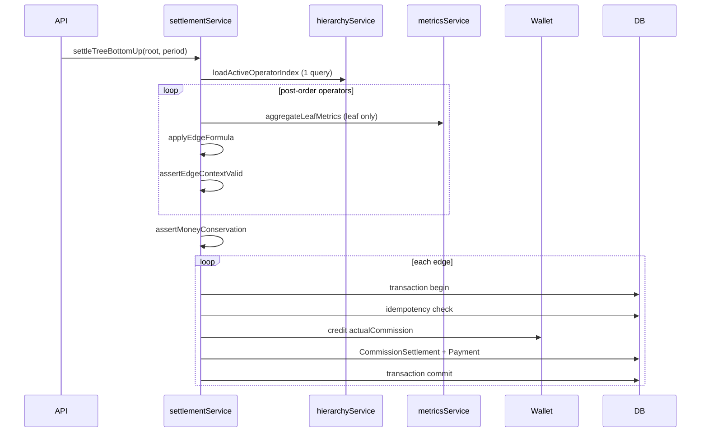

# Commission Engine — Technical Documentation


## Overview


The commission engine is the **only** commission implementation in production. It is a generic bottom-up recursive settlement system. Every parent→child operator edge uses the same algorithm. Commission math never branches on role names (`bookie`, `super_bookie`, etc.) inside `commissionEngine/`.


---


## Architecture


```

Players (User.referredBy = operatorId)

        ↓  leaf DB aggregation (Bet + QuizBet)

Leaf operator SettlementContext

        ↓  bottom-up post-order

Parent operator (consumes child contexts only)

        ↓

Platform remainder (parentOperatorId = null)

```


### Module layout


| Module | Responsibility |

|--------|----------------|

| `hierarchyService.js` | Operator tree (single query + in-memory O(n)) |

| `treeUtils.js` | Pure tree traversal, money conservation |

| `metricsService.js` | **Leaf-only** bet aggregation |

| `calculationService.js` | Pure `applyEdgeFormula` |

| `contextService.js` | Merge, idempotency keys, DTO mapping |

| `settlementService.js` | Bottom-up orchestration, transactions |

| `persistenceService.js` | `CommissionSettlement` + `CommissionPayment` |

| `walletSettlementService.js` | Operator wallet + ledger credits |

| `reportingService.js` | Earned vs settled reporting |

| `invariants.js` | SettlementContext validation |

| `settlementLogger.js` | Structured logs (no PII) |


### Controller flow


```

Controllers → commissionMetrics.js (facade) → commissionEngine/ → Wallet / DB

```


---


## Settlement Flow (sequence)





---


## SettlementContext


Runtime DTO passed upward. **Parents never re-query bets.**


| Field | Rule |

|-------|------|

| `totalBet` | Sum at leaf; unchanged through merge |

| `playerWinning` | Leaf only; zero at parent merge |

| `grossProfit` | Leaf only; zero at parent merge |

| `remainingDistributableIn` | Child `remainingDistributableOut` sum |

| `calculatedCommission` | `totalBet × %` |

| `actualCommission` | `MIN(calculated, remainingIn)` |

| `remainingDistributableOut` | `remainingIn - actual` |


### Money conservation


```

Σ(leaf grossProfit) = Σ(actualCommission) + platformRemainder

```


Enforced in `buildTreeEdgeContexts` via `assertMoneyConservationOrThrow`.


---


## Database relationships


```

Admin (operator)

  parentBookieId → Admin (parent operator)

  balance        → wallet


User.referredBy → Admin (leaf scope)


CommissionSettlement

  childOperatorId  → Admin

  parentOperatorId → Admin | null

  idempotencyKey   → unique

  commissionPaymentId → CommissionPayment


CommissionPayment

  bookieId → Admin


BookieWalletTransaction

  adminId, type: commission_bet_settlement

```


---


## Hierarchy API (generic)


Import from `utils/operatorHierarchy.js` or `services/commissionEngine`:


- `loadActiveOperatorIndex()` — single Mongo query

- `getOperatorTree(rootId?)`

- `getOperatorChildrenIds(id)`

- `getOperatorAncestorIds(id)`

- `getOperatorDescendantIds(id)`

- `getLeafOperatorIds(rootId?)`


DB field remains `parentBookieId`; exposed as `parentOperatorId` in traversal APIs.


---


## API flow (existing routes)


| Route | Behavior |

|-------|----------|

| `POST .../settle-bets` | `executeCommissionEngineSettlement` → `settleTreeBottomUp` |

| `POST .../pay` | Engine settlement (except `paid_with_advance` advance-pool path) |

| `GET dashboard / reports` | `getOperatorCommissionReport` / `getPlatformRemainderReport` |

| Daily commission cron | `getDailyCommissionEngineV2Snapshot` per operator per day |


---


## Developer onboarding


1. Run unit tests: `npm run test:commission`

2. Run integration tests: `npm run test:commission:integration`

3. Benchmark: `npm run benchmark:commission`

4. Preview without wallet: `previewCommissionEngineSettlement({ rootOperatorId, date })`

5. Execute settlement: `executeCommissionEngineSettlement({ rootOperatorId, period, actor })`


**Do not** add role-specific branches inside `commissionEngine/`. Extend `OPERATOR_ROLES` in `constants.js` for new operator types.


---


## Production checklist


- [x] `npm run test:commission` — 19 passing

- [x] `npm run test:commission:integration` — 3 passing

- [x] Idempotent double-settle (wallet unchanged)

- [x] Money conservation (no `MONEY_CONSERVATION_VIOLATION`)

- [x] Dashboard shows `actualCommission` on loss days

- [x] `CommissionSettlement` unique index on `idempotencyKey`

- [x] Single code path — no feature flag


See [COMMISSION_ENGINE_PHASE_D_REPORT.md](./COMMISSION_ENGINE_PHASE_D_REPORT.md) for full Phase D audit and certification.


---


## Known follow-ups (non-blocking)


- `parentBookieId` DB rename to `parentOperatorId` (schema migration)

- Remove `engineV2` marker from API responses when clients updated

- IST date bounds in daily commission cron (align with `buildIstDateFilter`)


