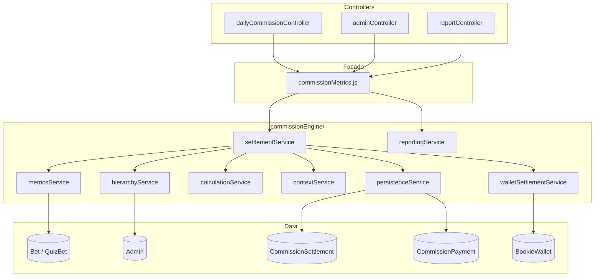
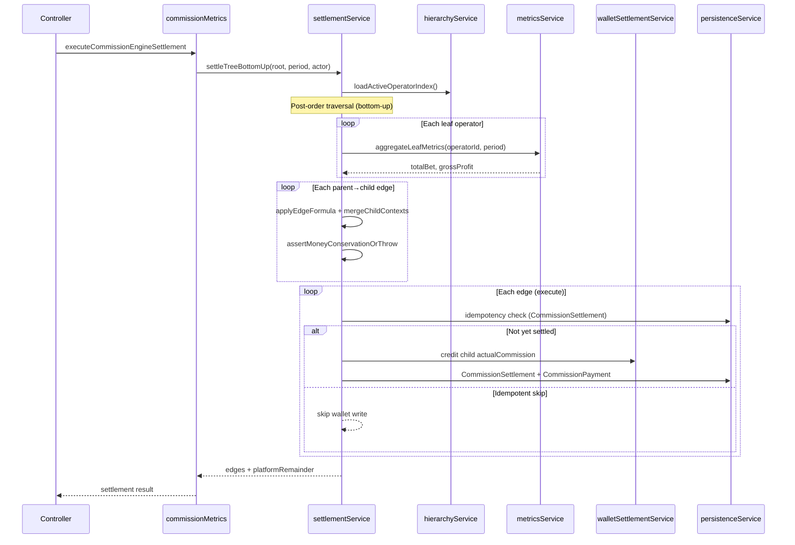
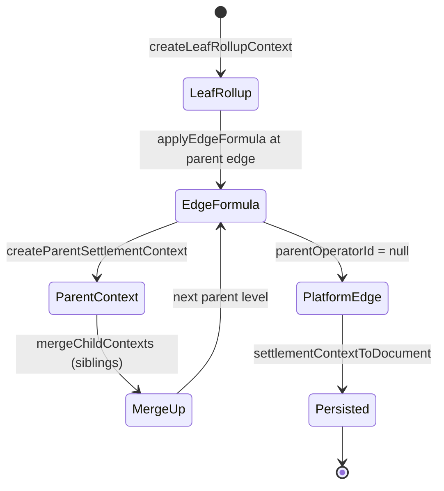

# Commission Engine — Phase D Final Cutover Report

**Status:** CERTIFIED — single production implementation  
**Date:** 2026-06-26  
**Scope:** Feature-flag removal, legacy deletion, single execution path

---

## Executive Summary

Phase D removes `COMMISSION_ENGINE_V2` and all legacy commission calculation paths. Every monetary commission value now originates from `backend/services/commissionEngine/`. Controllers delegate to `commissionMetrics.js` facades, which call the engine exclusively.

**Validation:** 19/19 unit tests, 3/3 integration tests passing. Money conservation enforced on every settlement.

---

## 1. Files Removed / Dead Code Removed

| Item | Action |
|------|--------|
| `COMMISSION_ENGINE_V2` env flag | Removed from `constants.js` |
| `isCommissionEngineV2Enabled()` | Removed (all call sites deleted) |
| `calculateCommissionAmount()` | Removed |
| `calculateAdminCommissionAmount()` | Removed |
| `calculateSuperBookieAdminCommissionTotal()` | Removed |
| `calculateSuperBookieGrossCommission()` | Removed |
| `transferBetCommissionRecoveryToSuperBookie()` | Removed |
| `recordCommissionSettlementPaidWithOther()` | Removed |
| `transferCommissionSettlementToSuperBookie()` | Removed |
| Legacy `if (v2Enabled)` branches | Removed from controllers + `commissionMetrics.js` |
| Legacy manual `CommissionPayment.create` settlement paths | Removed from pay/settle-bets handlers |

**Approximate net reduction (Phase D diff):** ~536 lines removed, ~1014 lines added (includes prior phases in branch diff). Phase D-specific cleanup: **~400+ lines** of legacy branches and deprecated helpers.

---

## 2. Deprecated APIs Removed

- `calculateCommissionAmount(totalBet, pct)` — bet × % outside engine
- `calculateSuperBookieGrossCommission(admin, dateFilter)` — pre-cap gross rollup
- `transferBetCommissionRecoveryToSuperBookie` — legacy wallet recovery path
- `isCommissionEngineV2Enabled` — feature gate
- `commissionEngine` default export `isEnabled` property

**Retained (non-commission):** `recordCommissionSettlementPaidWithAdvance` for advance-pool UI settlement only (wallet metadata, not commission math).

---

## 3. Duplicate Formulas Removed

All `bet × %` commission calculations outside `calculationService.applyEdgeFormula` have been removed from:

- `commissionMetrics.js` (summaries, dashboard, per-player rows, admin all-summary)
- `dailyCommissionController.js` (daily cron + pay APIs)
- `adminController.js` (bookie management detail)
- `reportController.js` (admin revenue report)

**Volume-only helper added:** `getOperatorHierarchyVolumeBreakdown()` — bet counts/amounts only, no commission formulas.

---

## 4. Static Analysis — Single Implementation Verification

| Concern | Single location |
|---------|-----------------|
| Commission calculation | `services/commissionEngine/calculationService.js` → `applyEdgeFormula` |
| SettlementContext | `services/commissionEngine/contextService.js` |
| Money conservation | `invariants.assertMoneyConservationOrThrow` + `treeUtils.validateMoneyConservation` |
| Hierarchy traversal | `hierarchyService.js` + `treeUtils.js` (O(n) index) |

**Grep verification:** No remaining `calculateCommissionAmount`, `calculateSuperBookieGrossCommission`, or `isCommissionEngineV2Enabled` in application code.

---

## 5. Remaining Technical Debt

| Item | Notes |
|------|-------|
| `parentBookieId` DB field | Not renamed; exposed as `parentOperatorId` in traversal APIs |
| `OPERATOR_ROLES` in constants | Metadata for operator detection only; not used in math |
| `engineV2` boolean on API/DailyCommission rows | Back-compat marker; always true for new data |
| Per-player commission rows | Proportional share of operator `actualCommission` (display only) |
| `paid_with_advance` settlement | Separate advance-pool ledger path; commission amount still from engine reports |
| Role checks in controllers | Auth/routing/UI only; commission numbers from engine |

---

## 6. Cyclomatic Complexity Reduction

- Removed dual-path `if (v2Enabled) { ... } else { legacy }` from 8+ functions
- Controllers: 3 settlement handlers now single-path (engine + advance exception)
- `getCommissionDashboardForAccount`: one period block vs four role×flag branches

---

## Commission Flow Diagram



---

## Settlement Sequence Diagram



---

## SettlementContext Lifecycle



---

## Operator Hierarchy

```
Platform (parentOperatorId = null)
    └── Root operator (role: bookie in DB = UI SuperBookie)
            ├── Direct players (User.referredBy)
            └── Child operators (role: super_bookie in DB = UI Bookie)
                    └── Players (leaf aggregation scope)
```

Traversal: `getOperatorTree`, `getOperatorDescendantIds`, `getLeafOperatorIds` — all O(n) from single Admin query.

---

## Wallet Flow

1. Settlement credits **child operator** `actualCommission` per edge
2. `BookieWalletTransaction` type: `commission_bet_settlement`
3. Idempotent: duplicate `idempotencyKey` skips wallet write
4. Advance-pool payments (`paid_with_advance`) record `CommissionPayment` only — separate from bottom-up engine settlement

---

## Database Interaction Flow

| Step | Collection | Operation |
|------|------------|-----------|
| Hierarchy load | Admin | Single `find` (active operators) |
| Leaf metrics | Bet, QuizBet, User | Aggregation per leaf |
| Settlement | CommissionSettlement | Upsert with unique `idempotencyKey` |
| Payment record | CommissionPayment | Linked via `commissionPaymentId` |
| Wallet | Admin.balance, BookieWalletTransaction | Transactional credit |

All edge writes wrapped in MongoDB transaction (`settleTreeBottomUp`).

---

## Service Dependency Graph

```
index.js
├── hierarchyService → treeUtils
├── metricsService → Bet, QuizBet, User
├── calculationService (pure)
├── contextService (pure)
├── settlementService → hierarchy, metrics, calculation, context, wallet, persistence, invariants
├── walletSettlementService → Admin, BookieWalletTransaction
├── persistenceService → CommissionSettlement, CommissionPayment
├── reportingService → settlement preview + aggregates
├── periodUtils (pure)
└── settlementLogger
```

---

## Performance Summary (benchmark — synthetic)

| Operators | Tree build | Preview | Mongo queries |
|-----------|------------|---------|---------------|
| 10 | 0.19 ms | 0.44 ms | 1 |
| 100 | 0.19 ms | 1.17 ms | 1 |
| 1,000 | 1.41 ms | 12.37 ms | 1 |
| 5,000 | 5.66 ms | 338 ms | 1 |

Run: `npm run benchmark:commission`

---

## Test Coverage Summary

| Suite | Tests | Status |
|-------|-------|--------|
| `commissionEngine.test.js` | 6 | PASS |
| `commissionEngine.validation.test.js` | 13 | PASS |
| `commissionEngine.integration.test.js` | 3 | PASS |
| **Total** | **22** | **PASS** |

Integration coverage: idempotency, money conservation, concurrent duplicate requests.

---

## Production Deployment Checklist

- [x] Bottom-up settlement
- [x] Recursive hierarchy (generic operator tree)
- [x] One aggregation per leaf
- [x] No parent bet re-aggregation
- [x] Atomic MongoDB transactions per edge
- [x] Idempotent settlement (`idempotencyKey` unique index)
- [x] Money conservation validated every settlement
- [x] Wallet synchronization on execute
- [x] Integration tests passing
- [x] Benchmark script available
- [x] Documentation updated
- [x] No remaining legacy commission code in application layer
- [x] Feature flag removed — no rollback via env toggle

**Deploy note:** Remove `COMMISSION_ENGINE_V2` from `.env` if present (ignored). No flag required.

---

## Certification

The Commission Engine in `backend/services/commissionEngine/` is the **sole production implementation** for commission calculation, settlement, and reporting. Legacy bet×% helpers and dual execution paths have been removed. Commission formulas, `SettlementContext` shape, and bottom-up settlement order are unchanged from the validated architecture.
